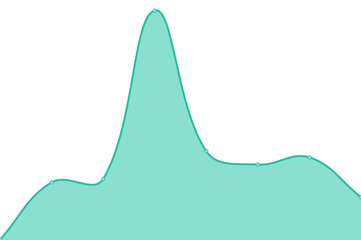
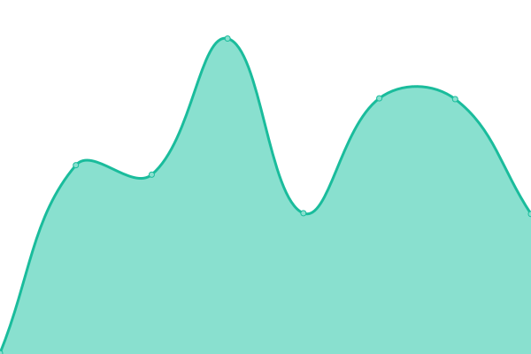

# [📈 Live Status](https://demo.upptime.js.org): <!--live status--> **🟩 All systems operational**

This repository contains the open-source uptime monitor and status page for [dipoapp](https://demo.upptime.js.org), powered by [Upptime](https://github.com/upptime/upptime).

With [Upptime](https://upptime.js.org), you can get your own unlimited and free uptime monitor and status page, powered entirely by a GitHub repository. We use [Issues](https://github.com/dipoapp/uptime/issues) as incident reports, [Actions](https://github.com/dipoapp/uptime/actions) as uptime monitors, and [Pages](https://demo.upptime.js.org) for the status page.

<!--start: status pages-->
<!-- This summary is generated by Upptime (https://github.com/upptime/upptime) -->
<!-- Do not edit this manually, your changes will be overwritten -->
<!-- prettier-ignore -->
| URL | Status | History | Response Time | Uptime |
| --- | ------ | ------- | ------------- | ------ |
|  [Main Website](https://dipo.app) | 🟩 Up | [main-website.yml](https://github.com/dipoapp/uptime/commits/HEAD/history/main-website.yml) | 

 149ms
     
 | 

<a href="https://status.dipo.app/history/main-website">100.00%</a>
    

|  URL Shortener | 🟩 Up | [url-shortener.yml](https://github.com/dipoapp/uptime/commits/HEAD/history/url-shortener.yml) | 

 667ms
     
 | 

<a href="https://status.dipo.app/history/url-shortener">100.00%</a>
    

|  Form App | 🟩 Up | [form-app.yml](https://github.com/dipoapp/uptime/commits/HEAD/history/form-app.yml) | 

 478ms
     
 | 

<a href="https://status.dipo.app/history/form-app">100.00%</a>
    

|  Video Share | 🟩 Up | [video-share.yml](https://github.com/dipoapp/uptime/commits/HEAD/history/video-share.yml) | 

 567ms
     
 | 

<a href="https://status.dipo.app/history/video-share">100.00%</a>
    

|  Note Share | 🟩 Up | [note-share.yml](https://github.com/dipoapp/uptime/commits/HEAD/history/note-share.yml) | 

 1076ms
     
 | 

<a href="https://status.dipo.app/history/note-share">100.00%</a>
    

|  File Share | 🟩 Up | [file-share.yml](https://github.com/dipoapp/uptime/commits/HEAD/history/file-share.yml) | 

 3050ms
     
 | 

<a href="https://status.dipo.app/history/file-share">100.00%</a>
    

<!--end: status pages-->

[**Visit our status website →**](https://demo.upptime.js.org)

## 📄 License

- Powered by: [Upptime](https://github.com/upptime/upptime)
- Code: [MIT](./LICENSE) © [dipoapp](https://demo.upptime.js.org)
- Data in the `./history` directory: [Open Database License](https://opendatacommons.org/licenses/odbl/1-0/)
